I have had an opportunity to work on a project that uses [Azure Cosmos DB](https://azure.microsoft.com/en-us/services/cosmos-db/) with the [MongDB API](https://docs.microsoft.com/en-us/azure/cosmos-db/mongodb/mongodb-introduction) as the backend database. I wanted to spend a little more time on my own understanding how to perform basic setup and a simple set of CRUD operations from a Node application, as well as construct an easy-to-follow procedure for other developers.

I have an Azure account that I created to explore Microsoft's capabilities, which I used to write this blog. At the time I created my account, I was not able to use a Gmail account, although this may have changed. If you are interested in following the steps below, I recommend getting your Azure account established first.

## Create and Configure Cosmos DB instance

After logging into Azure, the first step is to navigate to Portal, which contains all of the Azure cloud-based services.  
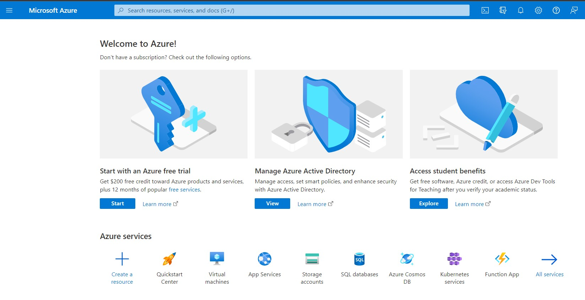

Services are pay per use and you'll be asked to provide a credit card even for the free trial. Make a note of when your trial period ends, so you can be aware when charges will start to accrue. As with other clouds, costs for smaller, personal applications will be nominal, but it is worth ensuring you know when the trial period ends to monitor use.

Locate the Cosmos DB option to start creating the service.  
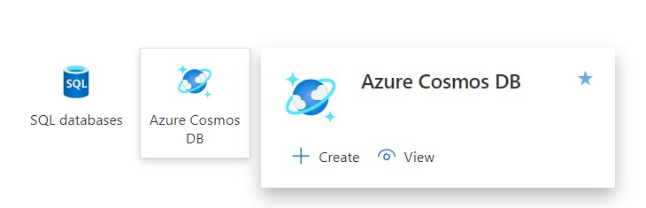

If this is the first instance to be created, the option to create a new account will be the main content on the page.  
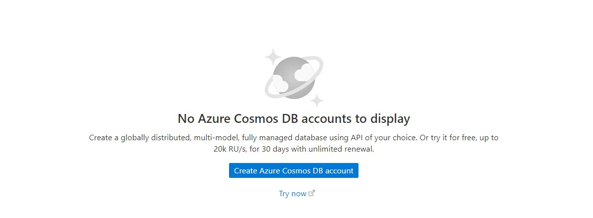

The first part of configuration is selecting a connection API. Microsoft encourages you to use the Core (SQL) option, which correlates to familiar SQL syntax for creating and using resources; there are SDKs for .NET, Javascript, Python and Java. There are a number of other APIs available, each with a description of their capabilities. The project I was modeling used the document database MongoDB API, so I selected **Azure Cosmos DB API for MongoDB**.  
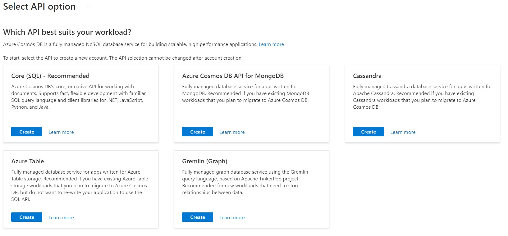

The second part of configuration is the project details:

- **Resource Group**: Likely you will need to create a new Resource Group to have a selection. Resource Groups are similar to folders, used to organize and manage resources. I named mine **SampleMongo**.
- **Account Name**: This is a unique account name; requirements are that it must be lower case and hyphen is the only character allowed other than letters. I named mine **samplemongoacct**.
- **Capacity mode**: The project I was modeling was created as **Serverless**, so I selected that option.

After clicking **Review + Create**, review the options that were set and click **Create**. Once the deployment is complete, click **Go to resource** to see the quick start information. This includes the connection string for your instance. I copied the Node version of the connection string.  
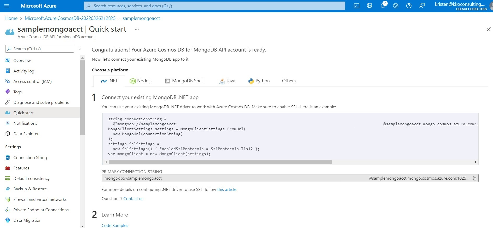

Click on Data Explorer in the left navigation to access the options to create a new database and new collections.  
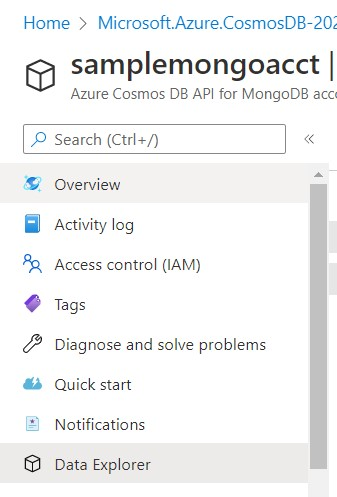

The highest-level container is Database, which Microsoft defines as a "logical container of one or more collections". Choose **New Database** from the main content dropdown. The single configuration item is **Database id**, which is simply a unique name; I named my database **Interests** so I can make collections of data about hobbies and interests I have.  
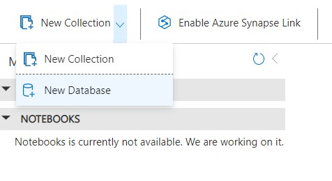

Once the database is created, you will be able to see it in the main content page.  
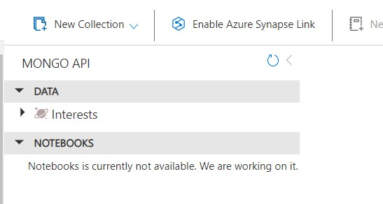

Next, choose **New Collection** from the 3 dots menu next to the database to create a collection for that database. The collections will hold documents that contain related information.  
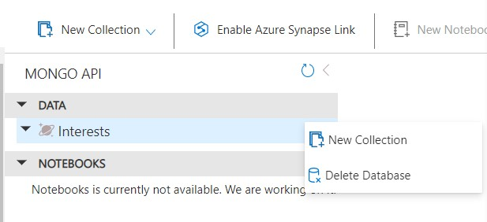

My collection will be about birds, so I selected my **Interests** database, set **Collection id** as Birds, left the other default options, and clicked **OK**.  
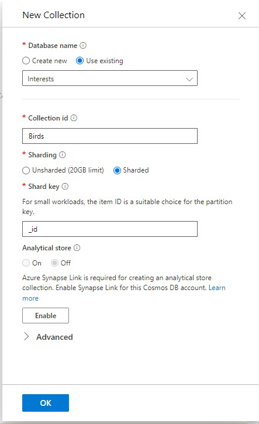

Once the collection is created, you will be able to see it nested under the database in the main content page.  
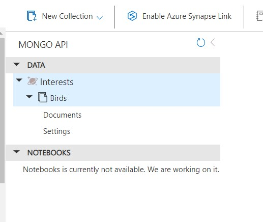

With the database and collection created, it is possible to access the collection and add records one by one, or use the shell to run a query. Since the project I was modeling would do that work from a Node app, I did not create any document records within Azure.

## Create a Node app to access the Cosmos DB

The link for the Node tutorial from Azure landed on a page that was no longer in service. I correctly assumed I would be able to easily locate the MongoDB API for Node on [npm](https://www.npmjs.com/). The developers for the [npm MongoDB package](https://www.npmjs.com/package/mongodb) thoughtfully included a really robust tutorial on the page, which I used to build out my sample app.

- After creating a new Node project and installing the `mongodb` package, create an `app.js` file at the project root for the example code.

- Require the `mongodb` package and declare variables for the connection and database

```Javascript
const { MongoClient } = require("mongodb");

// use the value of the Conn string defined for your Cosmos DB resource for this value
// Format: mongodb://samplemongoacct:<GUID>@samplemongoacct.mongo.cosmos.azure.com:<port>/?ssl=true&retrywrites=false&maxIdleTimeMS=120000&appName=@<Cosmos DB account name>@
const url = "";
const client = new MongoClient(url);

const dbName = "Interests";
```

- Define an `async` function to perform CRUD operations, including the collection name to work with

```Javascript
async function main() {
  await client.connect();
  console.log("Connected successfully to server");
  const db = client.db(dbName);
  const collection = db.collection("Birds");

  //// Create

  //// Read

  //// Update

  //// Delete

  return "Done";
}

main()
  .then(console.log)
  .catch(console.error)
  .finally(() => client.close());
```

- Implement `create` to add document records to work with

```Javascript
  //// Create
  const insertResult = await collection.insertMany([
    { name: "Chickadee", active: true },
    { name: "Cardinal", active: true },
    { name: "Bluejay", active: true },
    { name: "Sparrow", active: true },
  ]);
  console.log("Insert documents:", insertResult);
```

- Implement `read`, both a select of all available documents as well as a filtered select for a specific document

```Javascript
  //// Read
  const findResult = await collection.find({}).toArray();
  console.log("Found documents:", findResult);

  let filteredDocs = await collection.find({ name: "Chickadee" }).toArray();
  console.log("Found documents filtered by Chickadee", filteredDocs);
```

- Implement `update`, update one of my documents to contain a more specific name, then performed a filtered select to confirm

```Javascript
  //// Update
  const updateResult = await collection.updateOne(
    { name: "Sparrow" },
    { $set: { name: "Harris Sparrow" } }
  );
  console.log("Updated document", updateResult);

  filteredDocs = await collection.find({ name: "Harris Sparrow" }).toArray();
  console.log("Found documents filtered by Harris Sparrow", filteredDocs);
```

- Implement `delete` to remove all records from the collection

```Javascript
  //// Delete
  const deleteResult = await collection.deleteMany({});
  console.log("Deleted documents", deleteResult);
```

The process to set up the Cosmos DB instance and the Node sample app was straightforward. There is a large amount of documentation available to determine syntax and special cases to resolve issues. It was helpful to work through the process on my own and ground my understanding on both the structure and the code.

## Reference Links

- [Sample Node app](https://github.com/kristenkinnearohlmann/sample-mongodb-cosmosdb)
- [MongoDB CRUD Operations](https://www.mongodb.com/docs/manual/crud/)
