I had the opportunity recently to work on an existing project that had an Azure DevOps build pipeline. [Azure DevOps pipelines](https://docs.microsoft.com/en-us/azure/devops/pipelines/?view=azure-devops) have a lot of options and configurations and can be involved to dive into. 

I had some existing work I could use as a guideline but I knew I needed to try to figure out a basic build pipeline before I could proceed. I have a personal Azure DevOps account so I was able to model out the work I needed to do. To sign up for an account, a person needs to have an email account that is not associated to Google or other personal type accounts; I created a Zoho mail account to use for Azure.

## Configuration for sample Node.js application

I started with a basic Node.js app, [Simple Node Azure Pipeline](https://github.com/kristenkinnearohlmann/simple-node-azure-pipeline). I installed `dotenv` so I could work with variables in my sample script and prepare for using them in the Azure build pipeline.

```Javascript
// .env
name=Kristen
favColor=orange
favFood=chocolate
```

```Javascript
// src/app.js
console.log('Hello world, this is a simple Node app')
console.log(`Your name is ${process.env.name}. Your favorite color is ${process.env.favColor}. Your favorite food is ${process.env.favFood}.`)
```

I created a script in `package.json` to run locally and confirm that my `src/index.js` script worked as expected. I invoked `dotenv` from this script so that I wouldn't need to require it in `src/index.js`.

```Javascript
  "scripts": {
    "test": "echo \"Error: no test specified\" && exit 1",
    "simple": "node -r dotenv/config src/index.js"
  },
```

```bash
$ npm run simple
.
> simple-node-azure-pipeline@1.0.0 simple
> node -r dotenv/config src/index.js
.
Hello world, this is a simple Node app
Your name is Kristen. Your favorite color is orange. Your favorite food is chocolate.
```

I created a version of the `simple` script called `simple:ci`. The second version calls only `src/index.js` since variables will be handled by Azure. Our organization uses the `ci` tag to identify scripts run as a part of [CI/CD pipelines](https://www.redhat.com/en/topics/devops/what-is-ci-cd).

```Javascript
  "scripts": {
    "test": "echo \"Error: no test specified\" && exit 1",
    "simple": "node -r dotenv/config src/index.js",
    "simple:ci": "node src/index.js"
  },
```

This final version was pushed to a remote repo in Azure DevOps.

## Configure Azure DevOps Variable Group

The first action I took was configuring a [variable group](<https://docs.microsoft.com/en-us/azure/devops/pipelines/library/variable-groups?view=azure-devops&tabs=yaml>). These variables will be used later within the build pipeline.

- Navigate to **Pipelines > Library**  
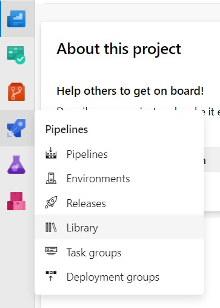
- Add a **Variable Group**  
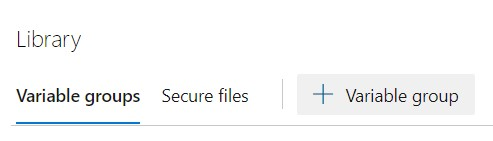
- Name the variable group and create entries for each variable, together with the value you want to use in the build pipeline  
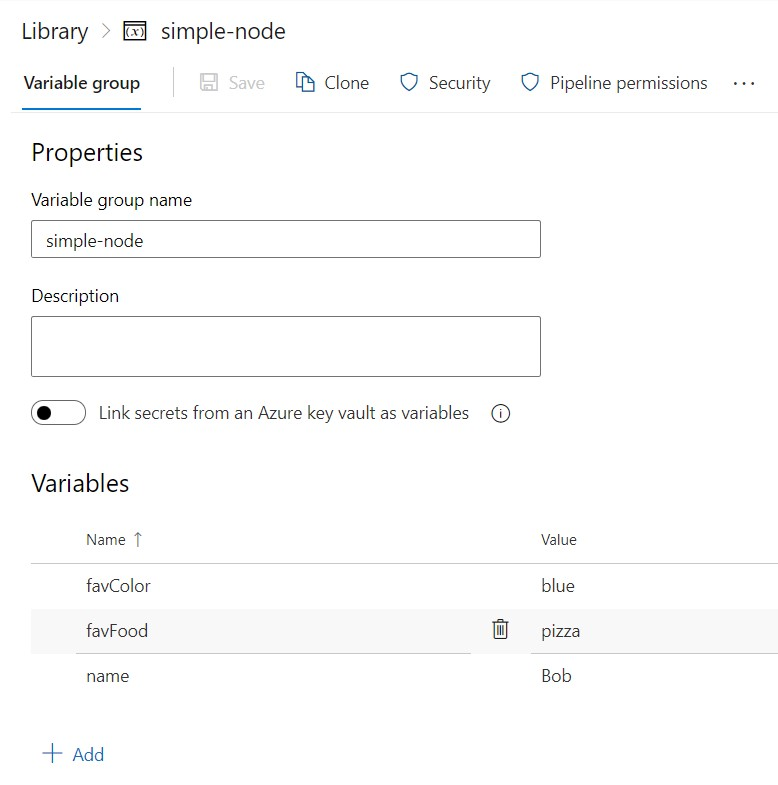

## Configure Azure DevOps Build Pipeline

- Navigate to **Pipelines > Pipelines**  
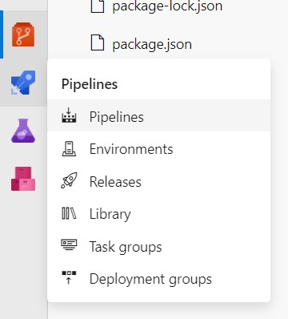
- Choose to **Create pipeline** (if there are no existing pipelines) or **New pipeline** (if other pipelines exist)  
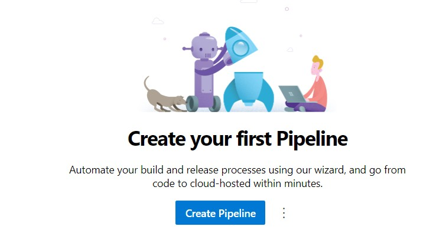
- In the **Connect** step, choose **Azure Repos Git** since the repo was pushed to the remote project  
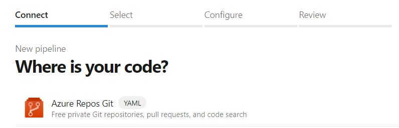
- Choose the repo to work with  
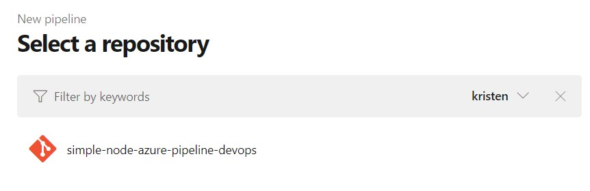
- Choose the project type; the repo contains a Node.js app  
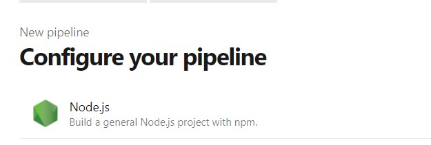
- A basic YAML file will be created.    
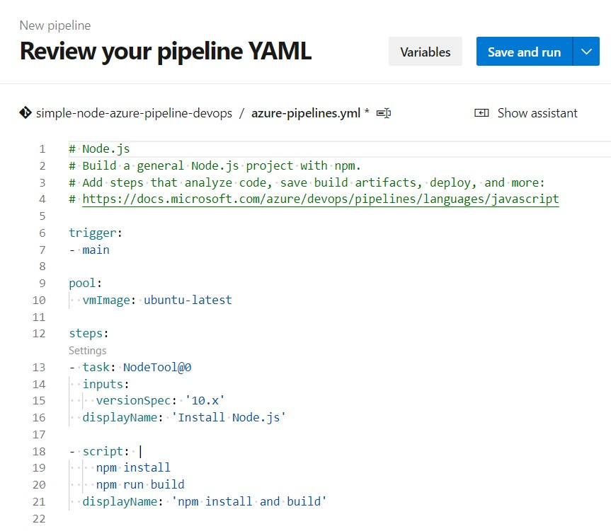
- From the **Save and run** dropdown, choose **Save** to work further with the file. **Note**: For future development, perform a pull locally before additional work to retrieve the YAML file.  
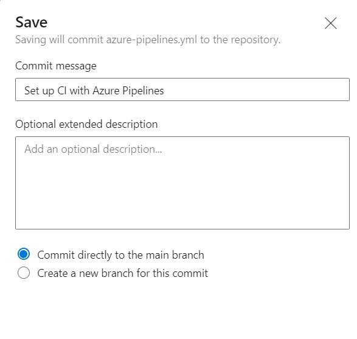

## Adjust YAML file for variable use

The basic YAML file needs to be updated to reference the variable group and its variables.

Additions to note in the image below:

- Lines 12 - 13: Add a reference to the variable group
- Line 21: Update the reference to the `simple:ci` script
- Lines 23 - 26: Add an `env` group and list the variable name and its correlated entry in the variable group enclosed in `$()`  
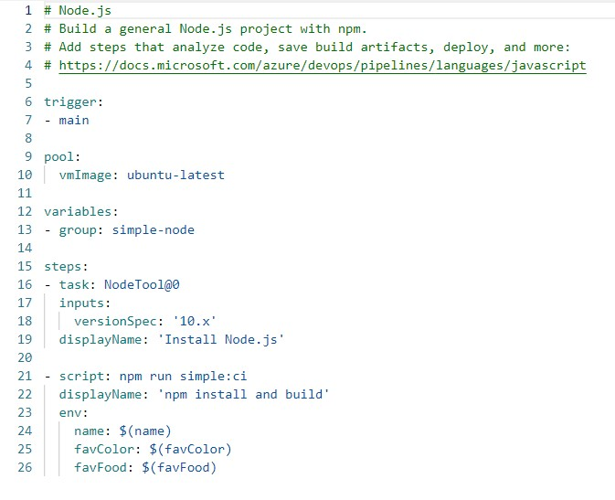

## Grant pipeline permission to variable group

- Return to **Pipelines > Library** and select the variable group to update
- Choose **Pipeline permissions**  
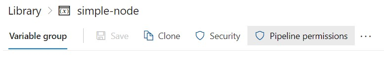
- Click the `+` to add the pipeline configured above to the permission group  
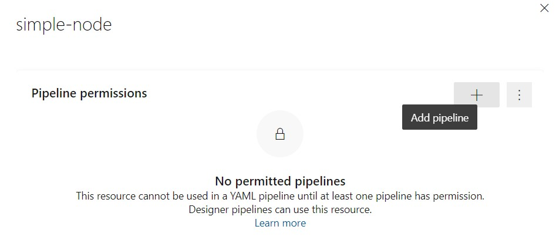
- The permissions are automatically saved

## Run the build pipeline

- Return to **Pipelines > Pipelines** and select the pipeline configure above. Choose **Run pipeline**  
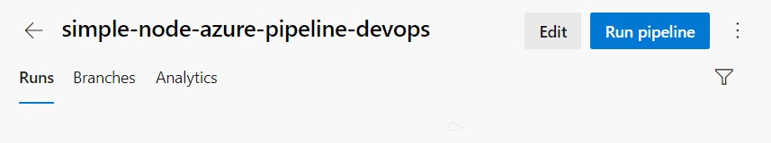
- Click the **Job** entry to monitor the run  
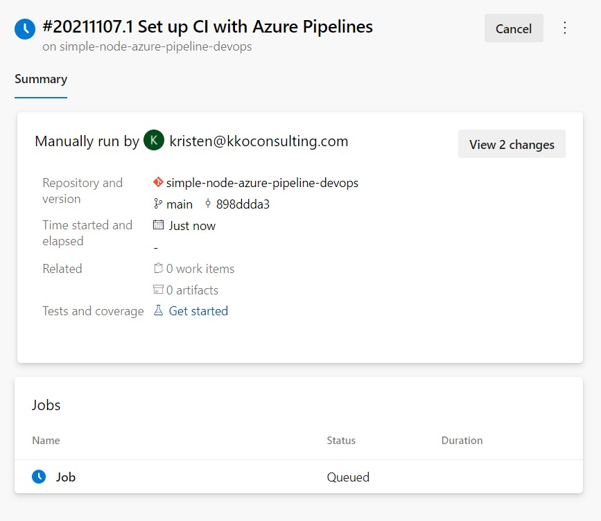
- The job will run through all of the configured steps, some of which have been set up by Azure  
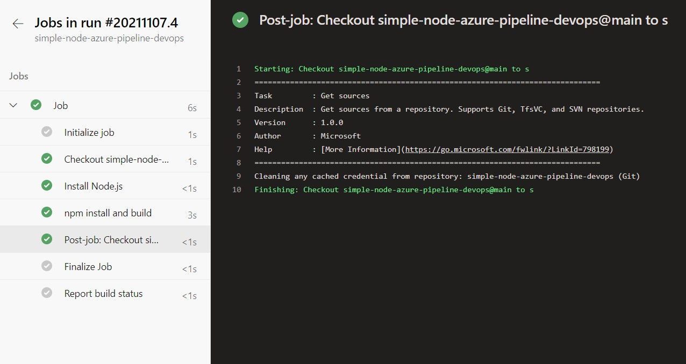
- Click on the `npm run and build` step that invoked the script; the output reflects the variables set in the variable group not the local set of variables  
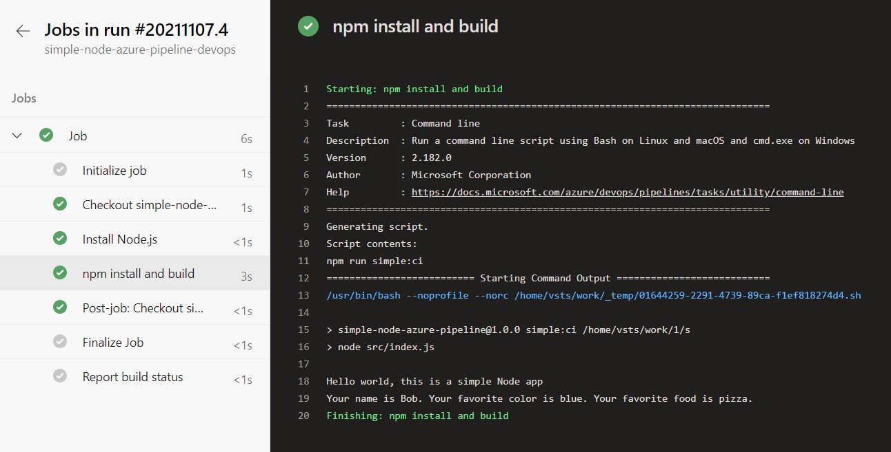

## Summary

This basic Azure DevOps build pipeline configuration provides an example of how to set up the pipeline and use variables from a variable group.

Once the configuration is established in the YAML, it can be further enhanced to perform other actions and tasks.