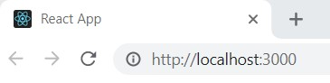
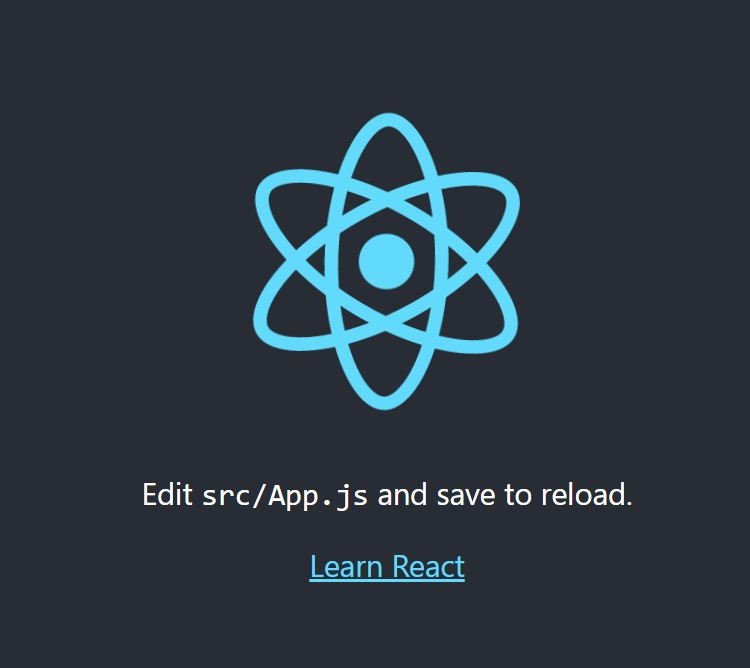

One of the things I find most valuable is a good quick-start guide. This is the guide I put together to get a React app started and pushed to GitHub, using the Bash terminal in VS Code.

1. In the terminal, navigate to the folder on your machine where you want to keep the local copy of your repo.

1. Use `create-react-app` to create the new application, replacing `<app-name>` for your application's name. Additional documentation is available at [reactjs.org](https://reactjs.org/docs/create-a-new-react-app.html).
```bash
npx create-react-app <app-name>
```

1. Once the application has been created, create a `main` branch (current GitHub default and preferred name) and delete the `master` branch (still the current default for `create-react-app`).
```bash
git checkout -b main
git branch -d master
```

1. To use `npm` instead of `yarn`, take the following steps:
   >1. Delete `yarn.lock`
   >1. Delete `node_modules` folder
   >1. Reinstall `node_modules` using `npm`
   ```bash
   npm install
   ```

1. Clean up the generated `README`, removing application boilerplate and adding any content desired for the first commit.

1. Test the basic React setup and enjoy the spinning React logo!
```bash
npm run start
```



1. Commit code locally.
```bash
git add .
git commit -m "Initial commit"
```

1. Go to your account on [GitHub](https://github.com/) and create the remote repo:
   >1. Use the same name used for the app creation
   >1. Don't choose to add any of the options for initializing the repo to avoid conflicts pushing the local repo; local already has `README` and `.gitignore` from the app creation and the license can be added later
   >1. Use the instructions from **…or push an existing repository from the command line** to link the local repo to the remote location; example code below, the code generated by GitHub will contain the correct values
   ```bash
   git remote add origin https://github.com/<GitHub user name>/<repo name>.git
   git branch -M main
   git push -u origin main
   ```

1. The basic React app is now ready for further development!