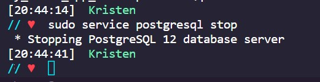

I started working through [freeCodeCamp's](https://www.freecodecamp.org/) beta curriculum for [Relational Database](https://www.freecodecamp.org/learn/relational-database/). I like to have a contrasting educational opportunity when I need a mental break; solutions to data structure and algorithm problems and other coding questions usually come to me when I'm studing a different topic.

Since databases are my original jam, I thought it would be profitable to work on my command line-level skills so I can gain strength with other types of databases. The first lessons introduce you to working with PostgreSQL to learn syntax. Although I'm very familiar with SQL itself, it had been some time since I had worked with Postgres on the command line. Part of the [Flatiron School](https://flatironschool.com/) curriculum had students install Postgress (for me, on my WSL install) but we used SQLite for projects so my knowledge of accessing and using Postgres had gotten fuzzy.

After spending a few days on the [CodeAlly](https://codeally.io/) platform that is included in freeCodeCamp's lessons, I decided to try looking back into my local install and get a set of basic instructions together. This will help when I return to my Flatiron projects to convert them to Postgres and deploy them to publicly available servers. For more information on installing Postgres, see <https://www.postgresql.org/>.

## Working with `psql` on WSL

I knew I had Postgres installed so the first thing I tried was to invoke it. I received an error message.


I vaugely recalled that the service is generally stopped so I tracked down the command to get it started.


I was now able to access `psql`. I had created an account for myself as part of my Flatiron studies so my account name appears as the prompt.


I didn't know what databases had been created, so I listed them with `\l`. There were a lot more than I recalled!


I connected to one of the databases I recognized from the setup lesson for Flatiron.


I reviewed the objects that were included in this database. The lesson must have been using a blog as the object to model, since one of the objects was a `posts` table.


I further reviewed what the sample lesson asked us to create as fields in the `posts` table.


I connected to a few other relations but found they were empty, so I went ahead and quit Postgres.


I also stopped the Postgres service until I needed it again.



## Basic commands for `psql`

- Check if `psql` is accessible

```wsl
psql
```

- Start Postgres service

```wsl
sudo service postgres start
```

- List available databases

```wsl
\l
```

- Connect to a specific database to work within it

```wsl
\c <database_name>
```

- Review relations in the database

```wsl
\d
```

- Review details of a specific relation

```wsl
\d <relation_name>
```

- Quit Postgres

```wsl
\q
```

- Stop Postgres service

```wsl
sudo service postgres stop
```
