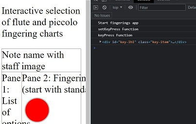

One of the things that can be very frustrating is running into a code issue you just KNOW you should be able to resolve. One of the things that can be the most satisfying is finding a good solution to solve that code issue.

A portfolio project I have been working on is an interactive flute and piccolo fingering chart. If you learned an instrument in your school years, you probably saw images similar to this:

<figure>
    
    <figcaption style="font-size: 0.75rem; font-style: italic;">You can now play the middle octave note D on the flute - congratulations!</figcaption>
</figure>

I am working on a site that will make displaying the different versions of the fingerings more interactive than a static set of images and text in tabular format.

Since 6 of the keys are basically circles, I started with those as a prototype. I have had a little experience with SVGs, so I located a W3 Schools tutorial for creating a filled circle.

```HTML
<svg height="100" width="100">
  <circle cx="50" cy="50" r="40" stroke="black" stroke-width="3" fill="red" />
</svg>
```

This will ultimately be closer to a set of keys that are outlined in silver and filled with black if they are to be pressed to make the note sound.

```HTML
<svg height="50" wdith="50">
    <circle cx="25" cy="25" r="20" stroke="silver" stroke-width="3" fill="none" />
</svg>
```

I ran into the code issue trying to implement click events in a DRY way. I didn't want to create a function per key; I wanted to be able to change the `fill` value from `none` to a color when the SVG was clicked. Up to this point, I have only needed to work with elements by ID because I only had very specific and targeted functions to create.

```JavaScript
// ES6
document.getElementById('element-id').addEventListener('click', () => {
    // code to execute written here
})
```

I knew that I could invoke a lookup on all elements with a specific class using `document.getElementsByClassName`. I found a great code snippet that showed iterating the HTML collection as an array and attaching a click event to each item. I knew that I could capture the element the function was attached to easily enough, but this code would run as soon as the page was loaded and never respond to my clicks.

```JavaScript
const setKeyPress = () => {
    Array.from(keyItems).forEach(element => {
        let key = element
        element.addEventListener('click', keyPress(key))
    })
}
// 
const keyPress = (key) => {
    console.log('Do work here')
}
```

I spent about 20 minutes running Google searches to resolve the issue seemed like it should not be a problem. Why couldn't I simply pass an argument to my function? The answer was to use `currying` instead, a concept that a co-worker once described briefly to me but I had yet to dig into. The basic idea is that you can boil down a function with multiple arguments into multiple functions with single arguments, as shown in this image from the [Wikipedia article](https://en.wikipedia.org/wiki/Currying):


In practice, this meant changing the `keyPress()` function I was calling in the click event handler to return a function that would take action when invoked, instead of on page load.

```JavaScript
const keyPress = (key) => {
    return function curried_func(e) {
        console.log('keyPress Function')
        console.log(key)
    }
}
```

With this enhancement in place, I was able to return messages to the console only when I clicked on the keys and the proper ID value from the associated `<div>` was returned.

**App start:**


**Clicking the first key:**


I can now use this code to appropriately update fingering charts based on user selection. I appreciate having the opportunity to begin learning about currying while resolving a tough and interesting issue.