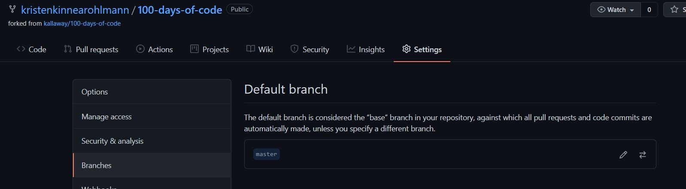
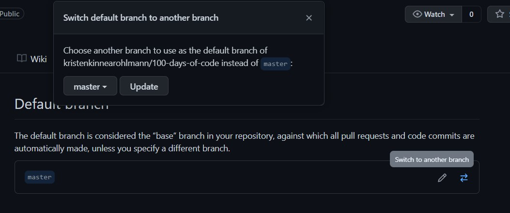
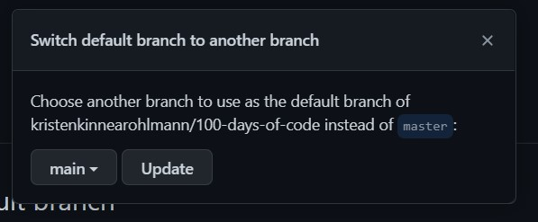
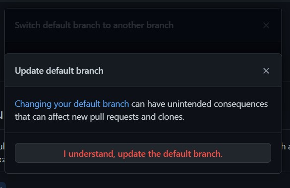
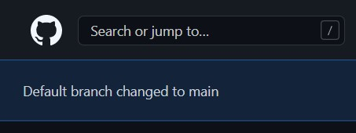
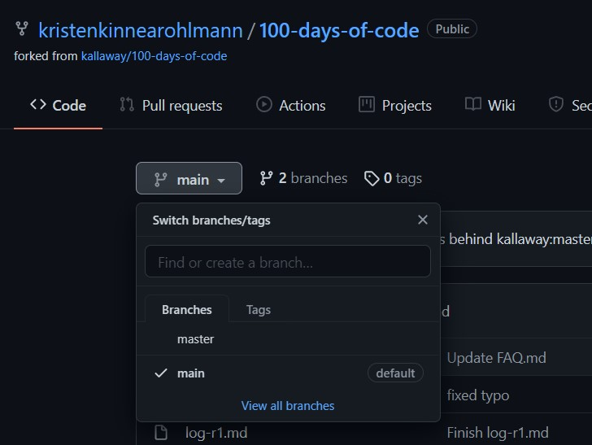
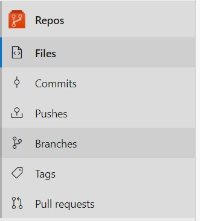
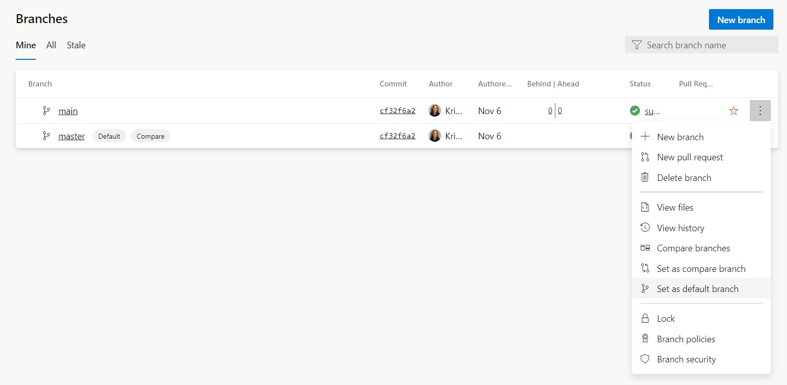
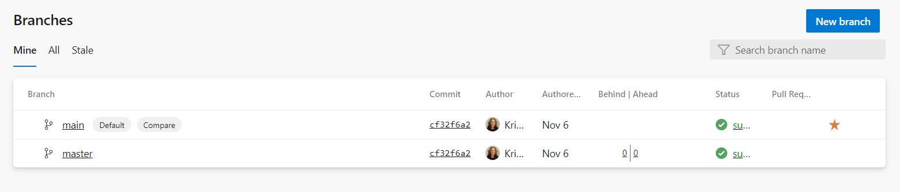

Many organizations began to be aware of and change non-inclusive language in the second decade of the 21st century. Many of those changes affected technology, including the choice for `git` to replace `master` with `main` for the default repo branch to avoid connotations with slavery.

While GitHub took actions to ensure new repos created on the site used `main`, older projects still used `master` as the default branch. In addition, some generator libraries still create new projects with `master` as the default and Azure DevOps also creates new repos with `master` as the default.

I had some time between projects at work in the last week and I wanted to tackle making the change for some organization repos I created to manage SQL objects and SSIS projects. This will allow all developers and contributors to have a common reference regardless of repo. There is a small process involved in making the change, as well as communicating the change to any other developers or contributors to the repo.

## Rename `master` to `main` and push to remote

- In the local environment, open a terminal and navigate to the project to be updated
- Move (rename) the `master` branch to `main`
```bash
git branch -m master main
```
- Push the new branch to the remote
```
git push -u origin main
```

## Reset default branch on GitHub

I use GitHub for my personal projects.  

- Choose **Settings** > **Branches**; `master` will display as the default branch  

- Click the arrows icon to **Switch to another branch**  

- Select the new `main` branch and click **Update**

- Acknowledge the warning for changing the default branch (ideally, you will communicate separately with others working in this repo that the default branch has changed)  

- A message will display confirming the change  

- Review the branches for the project and confirm that `main` is set as the default  


## Reset default branch Azure DevOps

My organization uses Azure Devops for version control.

- Choose **Repos** > **Branches**  

- Click the 3 dots menu on the `main` record and choose **Set as default branch**  

- Confirm the change to `main` as the default branch  


## Post-conversion

In each case, I plan to leave the `master` branch in place for about a week before removing it. At my work organization, I am in the process of informing other contributors about the need to change to using `main`.