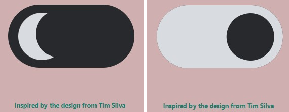
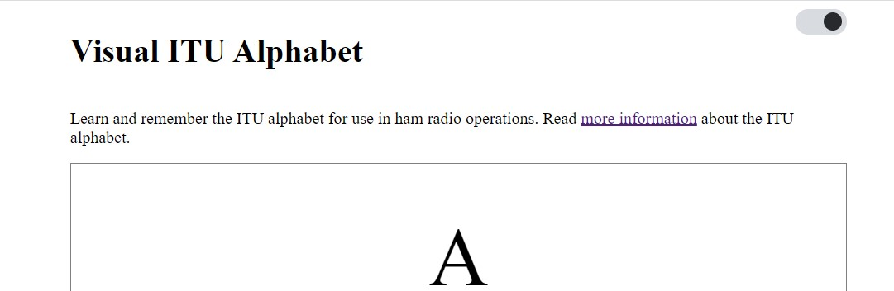
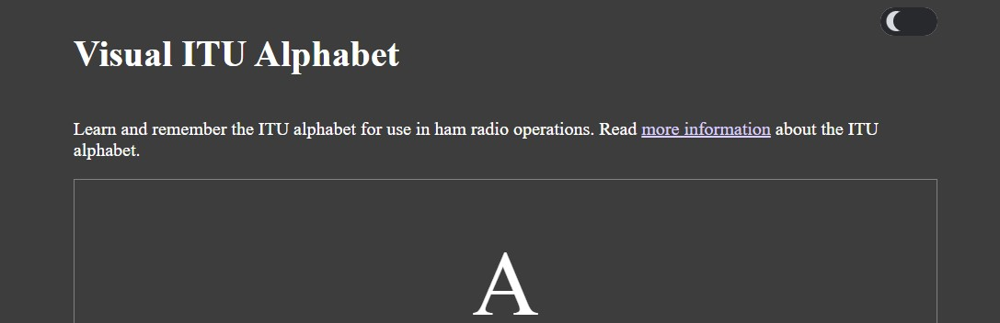

I was surprised to see that, with my busy June schedule, a full month has passed since my last blog! I have worked on a couple of projects, both personal and professional, in that timeframe that I can write about in the near future.

## Choosing The Next Visual ITU Alphabet Enhancement

An enhancement I wanted to make to the [Visual ITU Alphabet](https://visual-itu.netlify.app/) site was to add a light and dark mode toggle. This has become a very common feature on sites, and I wanted to be able to swap to a less-intense version of colors when my eyes were tired.

Rather than beginning from zero, I did a quick Google search for example CSS toggles. I found the article [20 Best Toggle Switches [Pure CSS Examples]](https://alvarotrigo.com/blog/toggle-switch-css/) and liked the very first example, [Dark Mode Toggle Switch](https://codepen.io/alvarotrigo/pen/zYPydpB).

## Implementing The Example Toggle And Adjusting To Fit New Styles

Part of my process is to retype any code I am working with to give my fingers a chance to understand what the code is doing. After reconfiguring the page header to add a space for the toggle to be placed, I performed an initial implementation of the code exactly as the toggle appeared in the example.

There were a couple of items I identified for completion on this MVP that differed from the example:

- I wanted the toggle to start in light mode, instead of dark mode as displayed in the example
- I wanted to make the toggle a smaller, single size so I could use it in both smaller and larger displays without needing to resize
- I wanted to add JavaScript to toggle the changes to the site

This was a good opportunity to work on my front-end skills!

The easiest part was to add some CSS variables to hold the various colors I planned to work with. This allows me to change my color scheme quite easily in the future between light and dark modes. I stuck closer to the default blue and purple colors for links to assist the user.

```css
:root {
  --lightPrimary: #d8dbe0;
  --lightUnvisitedLink: #0000ee;
  --lightVisitedLink: #551a8b;
  --darkPrimary: #28292c;
  --darkUnvisitedLink: #0cadff;
  --darkVisitedLink: #dcd0ff;
}
```

After choosing a width for my toggle, I thought it would be a simple matter of calculation to get to the values I needed. I tried a lot of math, without a lot of success, before I decided to perform the changes by "eyeballing" what the two phases of the toggle looked like.

Part of the challenge was changing the toggle from light mode => dark mode to dark mode => light mode. Here are the phases of the original design:



Part of the challenge was resetting the toggle to show light mode first, represented by a round sun-like shape that I realized was simply a shape with a border-radius set. The dark mode shape was the light-mode shape with a box shadow added to it to cut out a crescent. I tried some mirror-image calculations in the Chrome developer tools so I could easily reason and see what the changes looked like. After trial and error, I was able to reverse the modes:


To implement the mode color changes, I was able to add some CSS classes I could toggle in my JavaScript function but I wasn't sure how to tackle the body color change. I took the following actions:

- Add the primary dark and light colors to the `index.js file`

```javascript
const colorLight = "#fff"
const colorDark = "#3d3d3d"
```

- Add a function to listen for a click event that inspected the checkbox that was part of the example code

```javascript
modeToggle.addEventListener("click", event => {
  if (modeToggle.checked) {
    setElementStyle(document.body, {
      backgroundColor: colorDark,
      color: colorLight,
    })
    setElementStyle(letterInputEntry, {
      backgroundColor: colorDark,
      color: colorLight,
    })
    let el = Array.from(document.getElementsByTagName("a"))
    el.forEach(item => {
      item.classList.add("dark-link")
      item.classList.remove("light-link")
    })
  } else {
    setElementStyle(document.body, {
      backgroundColor: colorLight,
      color: colorDark,
    })
    setElementStyle(letterInputEntry, {
      backgroundColor: colorLight,
      color: colorDark,
    })
    let el = Array.from(document.getElementsByTagName("a"))
    el.forEach(item => {
      item.classList.add("light-link")
      item.classList.remove("dark-link")
    })
  }
})
```

- Add `setElementStyle` function that I located on another resource to abstract setting a style on an element that is used by the event listener above

```javascript
const setElementStyle = (element, styles) => {
  Object.assign(element.style, styles)
}
```

After implementing these changes, I was able to toggle between light and dark modes, with each render displaying properly after each change:




## Summary And Future Enhancements

The resulting toggle and functionality works well. There are some additional changes I would like to implement:

- Determine how I can change body color together with the other CSS changes so I don't need to maintain variables in two files
- Determine how to add additional color schemes
- Determine how to adjust the associated images as well as the text color

The files that were updated for these changes:

- [assets/styles.css](https://github.com/kristenkinnearohlmann/itu-alpha/blob/main/assets/styles.css)
- [src/index.js](https://github.com/kristenkinnearohlmann/itu-alpha/blob/main/src/index.js)
- [index.html](https://github.com/kristenkinnearohlmann/itu-alpha/blob/main/index.html)

This was good practice working with CSS and front-end styling. The identified enhancements will continue that practice and give me an opportunity to refactor the code further.
