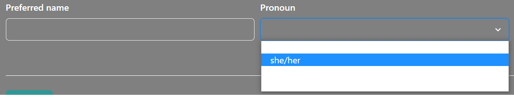
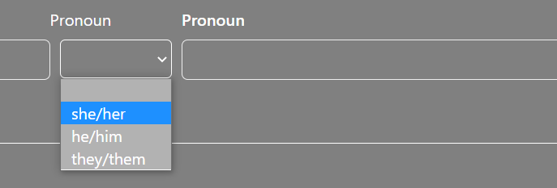
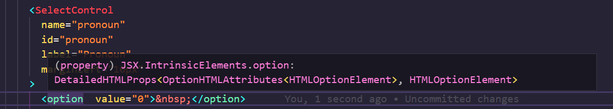
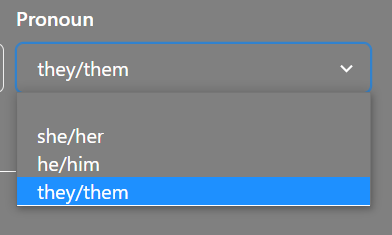
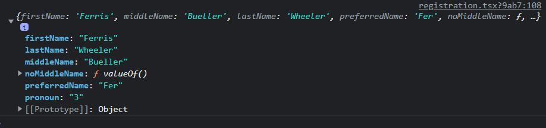

I resolved an interesting issue while continuing the build on my registration form for the [Breeze Lakes Point](https://breeze-lakes-point-2.vercel.app/signin) project using Next.js. I really struggled to find the proper way to style the Formik Chakra UI `SelectControl` component so that it matched the other controls. I wanted to have drop-down lists styled with the same grey background and white text that was the default for the form.

The default theme style for the `SelectControl` was to display the drop-down items with a white background that blended with my text color, which is set to white.


```Javascript
<SelectControl
    name="pronoun"
    id="pronoun"
    label="Pronoun"
    marginLeft="10px"
>
    <option value="0">&nbsp;</option>
    <option value="1">she/her</option>
    <option value="2">he/him</option>
    <option value="3">they/them</option>
</SelectControl>
```

I Googled for a solution but wasn't finding anything that helped me determine how to reset the background color of the drop-down items on the `SelectControl`.

I was able to style a conventional `select` control with classes defined in my `global.css` so that the display matched the other form controls.


```Javascript
<select className="bgtransparent form-element">
    <option className="bgtransparent-child" value="0">&nbsp;</option>
    <option className="bgtransparent-child" value="1">she/her</option>
    <option className="bgtransparent-child" value="2">he/him</option>
    <option className="bgtransparent-child" value="3">they/them</option>
</select>
```

The issue with this solution was that I wasn't able to leverage the Formik and Yup conventions to populate the control with values, validate input values, or gather the selected values for use in form submission. I could certainly have written some additional functions to handle those actions but I wanted to be able to manage all form inputs in the same way. Using the `SelectControl` included with `formik-chakra-ui` was the way to accomplish those goals, but the configuration that worked for a conventional `select` control did not work for a `formik-chakra-ui` `SelectControl`.

I spent some time simply hovering over pieces of my code in VS Code to see what the intellisense might suggest for formatting the `SelectControl`. I tried a few options but was drawn back to the option to use HTML Attributes.


I recalled in my searches and other code examples that the use of the double `{{}}` allowed execution for code like additional formatting. I added `style={{ backgroundColor: "gray" }}` to each option for the `SelectControl` to blend into the current page color.

```Javascript
<SelectControl
    name="pronoun"
    id="pronoun"
    label="Pronoun"
    marginLeft="10px"
>
    <option style={{ backgroundColor: "gray" }} value="0">
        &nbsp;
    </option>
    <option style={{ backgroundColor: "gray" }} value="1">
        she/her
    </option>
    <option style={{ backgroundColor: "gray" }} value="2">
        he/him
    </option>
    <option style={{ backgroundColor: "gray" }} value="3">
        they/them
    </option>
</SelectControl>
```

This code allowed me to style the `SelectControl` to match my page style and capture the values for submission to the database.



The next refactor of this code is to write a more flexible option for incorporating styles into the individual options.

I wasn't able to find any other sources that explained how to accomplish the solution. I hope this explanation will be helpful to other developers working with Next.js, Formik, and Chakra UI.
