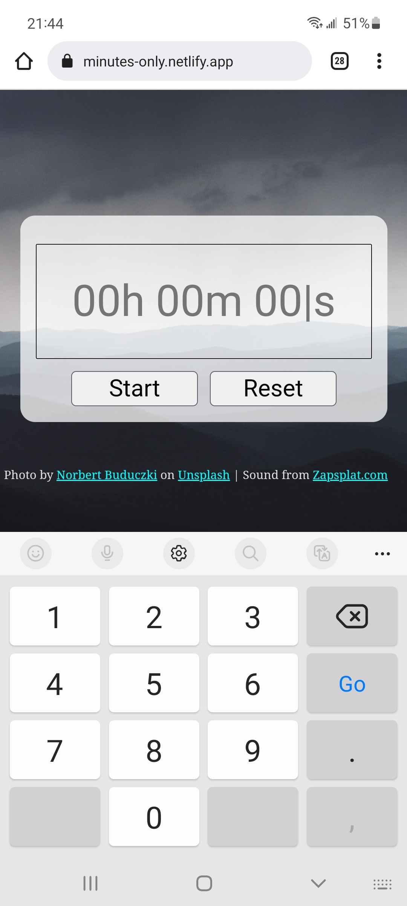

Since my last blog, I made great progress on the app for my husband, [Minutes Only](https://minutes-only.netlify.app/); the source repo for the project is <https://github.com/kristenkinnearohlmann/minutes-only>. One of the big challenges to solve was ensuring my app worked on Android Chrome, since we both use Android-based phones.

After putting in quite a lot of work on an interface where the user would be able to click an input text box to enter the desired time, I deployed my app to [Netlify](https://www.netlify.com/) so I could try it on my Android phone. I had spent a large chunk of time on ensuring I could design the site, simple as it is, as mobile-first (see my blog about [desiging with viewport](https://kristenkinnearohlmann.dev/designing-with-viewport/)), so I thought this would be a simple smoke test.

I was quite surprised to find I got no entry keyboard on my phone when clicking my text input box. Frankly, I was surprised - I wasn't at all sure what was going on! I furiously Googled for the issue and my research mainly led me to believe this was a known issue not yet solved. Android always returns 229 for the keyCode, no matter what key you are pressing. This is because Android does not recognize a keydown or keyup event as an event occurring. Argh!

I was especially annoyed because I was also lightly trying to reverse-engineer Google's own stopwatch but not working too hard to find their JavaScript. Clearly, they had their "secret sauce" in order to resolve this but I wanted to get something working for use.

My research was fruitful in that it suggested I had to switch to an input element that specified `number` as the input. I was initially concerned about this, because my design included displaying text in the placholder but I was able to quickly restore the placeholder updated with the entered number. My JavaScript code had gotten pretty messy at this point so it also forced me to refactor with some rather delightful results - my code was quite a lot cleaner than it had been, and I was able to solve problems more quickly!

The result was success: I was able to enter a time value, see it convert to minutes and seconds, and watch it run.

My husband was delighted with how it looked on his computer, and also managed, via "bad user testing", to find a couple of flaws for me to fix. I have also found the timer doesn't run accurately, so with the MVP completed I can spend time working on features to enhance the basic working model.
