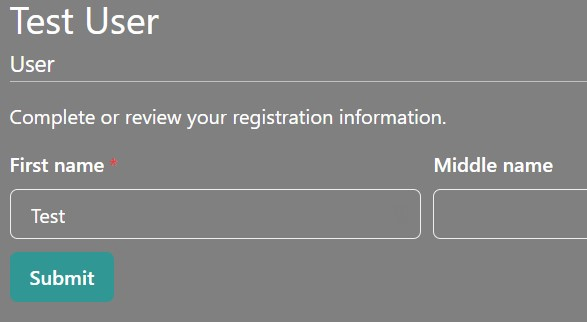
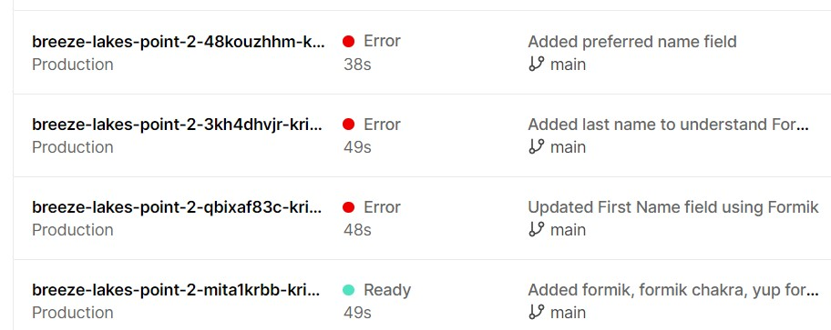
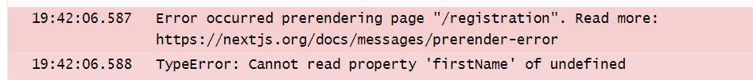

I was truly excited last week to deploy my [Breeze Lakes Point project](https://breeze-lakes-point-2.vercel.app/) to [Vercel](https://vercel.com/) and have it working in the real world! Having authentication and a landing page gives you an excellent starting point to build a detailed, strong app.

In the previous version of this project, I had started working on a form using Redux to handle the state. With Nextjs, a lot of the work for maintaining and using state can be abstracted away and the resulting updates can be handled within the same project. Before I could get started leveraging this functionality, however, I needed to rebuild my form!

During the workshop that I took, we used [Chakra UI](https://chakra-ui.com/)'s basic form functionality to build the sign in and sign up form. I knew I needed more functionality to build a robust registration form, which is the next feature on my list. I poked further into Chakra's documentation and discovered they recommended pairing their functionality with [Formik](https://formik.org/).

I located a really great example [Formik Chakra UI](https://codesandbox.io/s/formik-chakra-ui-27yzm?file=/src/Form.tsx), hosted on [CodeSandbox](https://codesandbox.io/), that also used [Yup](https://github.com/jquense/yup) for object validation. I installed the following:  
`npm i formik`  
`npm i formik-chakra-ui`  
`npm i yup`

I was able to create a working example pretty quickly, including pre-populating first name from my User object:  


I was happily working along, adding more fields, pushing my code to GitHub, which in turn was generating deployments on Vercel. I was sure everything was fine but I wanted to take a look at how the form looked "in the wild", so I navigated to the site, and saw only the First name field. Then I took a look at the deployments:  


Oops! A number of my commits had resulted in build errors:  


This error made sense, because I know there is an asynchronous update to my User object. What I couldn't figure out was how to adequately resolve the issue. My Google research found very useful information:

- The Formik example showed setting initial values on the form from an object you define and pass in. It is possible to set to a function instead, where you can check whether asynchronous values have returned and use empty strings in their place if they have not. In my code, `initialValues` holds the fallback object, and `userValues` is used once data is updated.

```JavaScript
//...
const getData = () => (user?.id ? userValues : initialValues);
//...
        <Formik
          initialValues={getData()}
// ...
```

- Setting `enableReinitialize={true}` upon instantiating the form will allow the asynchronous values to populate once received.

```JavaScript
// ...
        <Formik
          initialValues={getData()}
          onSubmit={onSubmit}
          validationSchema={validationSchema}
          enableReinitialize={true}
        >
// ...
```

With these 2 changes, my code built and deployed successfully. If you would like to take a look at the form in action, use the following test credentials for [Breeze Lakes Point](https://breeze-lakes-point-2.vercel.app/signin) and click the link for the **Registration** page:  
**Username:** sample@user.com  
**Password:** samplepwd

I have learned so much this week from this project alone and I'm looking forward to getting this feature fully complete and delivered for demo.
