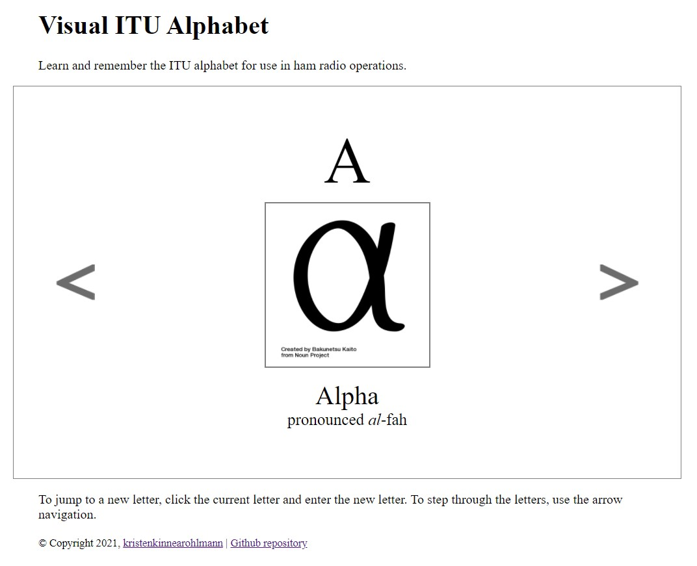

The first project I released post-bootcamp was the Visual ITU alphabet. Created by the International Telecommunications Union (ITU) in 1926, amateur (ham) radio operators use the ITU alphabet to communicate their FCC radio call signs and other information. I always had a tough time remembering the word that was associated to the letter and wanted to create a site that would unite the word and a visual symbol to aid in memorization.

<figure>
    
    <figcaption style="font-size: 0.75rem; font-style: italic;">Visual ITU</figcaption>
</figure>

While I included arrows for left and right navigation through the alphabet, I wanted to allow a user to be able to change the letter directly. I didn't want the input to look like a form right away; I wanted the user to click the letter and be given an input box. This was probably the easy part of the feature to implement, since I elected to have the elements available to be displayed or hidden as needed.

```JavaScript
document.getElementById('display-letter').addEventListener('click', () => {
    changeDisplayLetter()
})
```
```JavaScript
const changeDisplayLetter = () => {

    displayLetter.classList.add("hidden")
    changeLetter.classList.remove("hidden")

    changeLetterInput.placeholder = currentLetter.letter
      
    changeLetterInput.focus()
    changeLetterInput.select()
}
```

The tricky part that gave me trouble was how to accept the input given since I was not styling this as a form with a `Submit` button. It's pretty common to hit the `Enter` key when you fill in a form, so that was the first implementation I completed. While working on this code, I found that you can now use `event.key` where I had previously learned `event.keyCode`.

```JavaScript
changeLetterInput.addEventListener('keyup', (event) => {
    const keyPressed = event.key

    if (keyPressed === 'Enter') {
        updateDisplayLetter(event)
    }
})
```

I realized that it also quite common to "click out" of an input field and expect that input to have an effect on the page. I really wanted `focusout` to be the answer, but it never fired in my testing. I realized that simply clicking away wasn't quite the same action. I started to work with `blur` instead and it seemed to work great!

```JavaScript
changeLetterInput.addEventListener('blur',(event) => {
    updateDisplayLetter(event)
})
```

Things were working well with the display changing content except that my input box was showing the previous letter choice, in lowercase if I entered it that way, when I clicked again to change the letter. No problem, I'll just clear out the input box once the letter has been entered and looked up in the object containing all the letters. But this code below kept throwing errors in the console:

```JavaScript
    changeLetter.classList.add("hidden")
    displayLetter.classList.remove("hidden")
    displayAlpha()
    changeLetterInput.value = ""
```

I added some strategic `console.log` statements and some breakpoints to debug. I realized that when I clicked out of the input box, the `blur` event was being called a second time. The letter variable wasn't filled in, since there was no change occurring, and an error was thrown. By checking whether I had already added the `hidden` class back into `<div>` that contained the input element, I stopped the second check from occurring and provided a smoother experience for the user.

```JavaScript
changeLetterInput.addEventListener('blur',(event) => {
    // invoke only if the blur occurs when the input is display
    if (!changeLetter.classList.contains("hidden")) {
        updateDisplayLetter(event)
    }
})
```

I had created a separate branch for this feature, so I also had the opportunity to create a pull request in GitHub to merge this new code for Netlify to build out to the live site. This feature makes it much easier to go to the letter you can't remember, or to spell things out for yourself. Give it a try!!

<https://visual-itu.netlify.app/>

I really enjoyed the process of investigating JavaScript events, working through an issue, creating a pull request and publishing a new working feature to my application. There are a few more defined features I am looking forward to implementing soon!