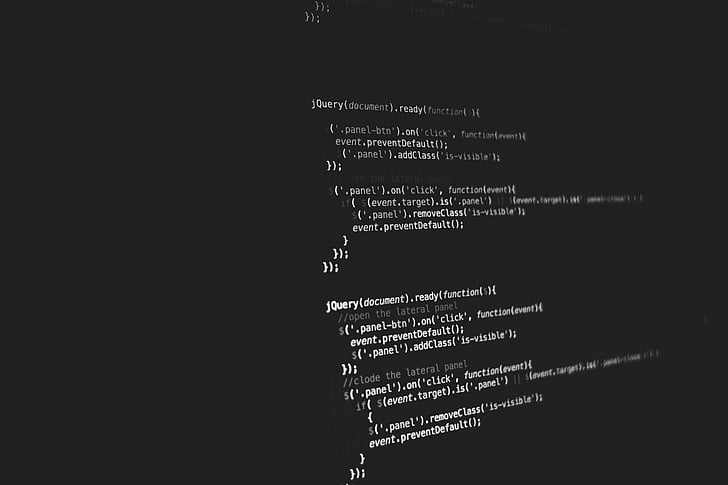

This week, I picked up a work item for my organization that involved jQuery. The description and technical analysis of the work item were presented in vanilla JavaScript. When I looked into the file where the solution was to be written, I noticed a whole lot of `$`. It took me a couple of minutes before I realized it was jQuery!

<figure>
    
    <figcaption style="font-size: 0.75rem; font-style: italic;">That's a whole lot of dollar signs!</figcaption>
</figure>

The [Flatiron School](https://flatironschool.com/) curriculum frequently reminded students that although we were being taught ES6 and React, we would encounter different frameworks and older code bases in our work. I felt pretty good that I was able to determine what the code was that I was reviewing despite my initial confusion!

The goal of the work item is to iterate through a `<div>` that has multiple `<p>` tags containing descriptions; if those descriptions are longer than set amount of characters, the description should be truncated and an ellipsis (`...`) should be added to the end. The person that completed the technical analysis had done some of the work to target the proper set of `<p>` elements that would need to be changed but I couldn't immediately determine how to finish the code. An additional complication to the work is the solution required another person's code changes that weren't yet complete to run the code. 

I coded as much as I could before finishing work for the week. On the weekend, I was determined to understand how I could properly target elements using jQuery. I could see that the basic method to access elements was the same as I had learned for vanilla JavaScript, so it was just a matter of figuring out how jQuery differed. I researched W3 schools and the jQuery documentation and learned that code needed to be enclosed in the `$(document).ready` function and that elements were access via `$()`.

```JavaScript
$(document).ready(function () {
    return true
});
```

Elements are targeted in a very similar way to vanilla JavaScript by using HTML elements, classes and IDs to target the specific element to change.

```JavaScript
$("#test").find("p")
```

I found my old friend `this` helped me to sort out the `<p>` tags appropriately. I made a special effort to really understand how `this` functions in JavaScript (there are many well-written blogs on this topic!) so I when I was trying to figure out how to iterate items that were enclosed by a specific element, I could use `this` to access them in turn.

```JavaScript
$(this).text(truncate($(this).text()));
```

I was able to use [CodePen](https://codepen.io/your-work) to set up a [working example](https://codepen.io/kristenkinnearohlmann/pen/BaZrLRR) based on my memory of the code structure from my work project. Having worked through the problem on an example I set up, I believe I will be able to set up a similar example on Monday when I have the actual code in front of me.

```JavaScript
$(document).ready(function () {
  var testParas = $("#test").find("p");
  testParas.each(function () {
    $(this).text(truncate($(this).text()));
  });
});
```

I know that with each problem we solve, we strengthen our learning and abilities. I am looking forward to continuing to learn and support the existing code base at my organization while expanding my knowledge of various JavaScript libraries like jQuery.