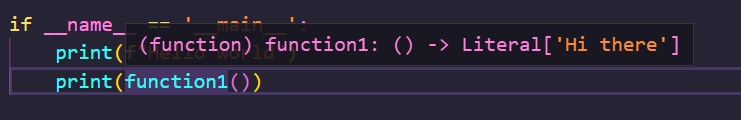
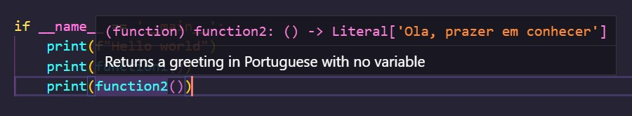

I was working through a tutorial on [Real Python](realpython.com) and learned an interesting fact that filled a gap I had noted previously.

A few years ago, I wrote a small Python app to process data from a source to a SQL Server destination. I had been picking up small portions of Python since 2017; while I had enough knowledge to create a working solution, there were many things I know I would have liked to refactor or do more efficiently. One such item was the desire to provide a description for the functions I was abstracting out for the app.

In the Real Python tutorial, the teacher was discussing [docstrings](https://peps.python.org/pep-0257/), a string literal. When it occurs as the first statement in a function, it performs as a special attribute and displays an explanation of the function. The best practice is that it should not be a repeat of the function signature, since that will be displayed already, but a brief explanation of purpose of the function.

Here is an example of a function without a docstring - only the function signature, if provided, is displayed:

```Python
def function1():
    return "Hi there"
```



Here is an example of function with a docstring - the contextual help displays the text from the docstring as well as the function signature, if any:

```Python
def function2():
    """Returns a greeting in Portuguese with no variable"""
    return "Ola, prazer em conhecer"
```



This clears up mysteries in your code, whether all your functions reside in the same file or not. You can quickly recall why you abstracted away the code and how you intended to use it. This functionality can and should be used for methods that are members of a class so developers using your code understand the purpose of the method. All of the same best practices will apply.

When I have an opportunity to refactor my data processing Python app, I will take advantage of docstrings to help me and other contributing developers quickly understand what each function is doing.
