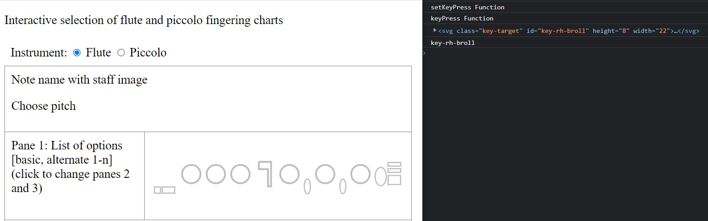

I have been chipping away for a few weeks on my project to have an interactive chart of flute and piccolo fingerings. Working on this project has allowed me to learn how to create SVGs and curried functions.

The problem I have been working on was how to ensure my key layout mimicked the instrument layout as closely as possible. In particular, there are small "roller" keys controlled by the right pinky on the flute that I needed to have display closer together than the `div`s were rendering.

My original code for the keys looked like this:

```Javascript
            <div id="key-rh-broll" class="key-item key-item-roller">
                <svg height="8" width="22">
                    <rect x="1" y="1" height="6" width="20" stroke="silver" stroke-width="2" fill="none" />
                    Sorry, your browser does not support inline SVG.
                </svg>
            </div>
            <div id="key-rh-croll" class="key-item key-item-roller">
                <svg height="8" width="22">
                    <rect x="1" y="1" height="6" width="20" stroke="silver" stroke-width="2" fill="none" />
                    Sorry, your browser does not support inline SVG.
                </svg>
            </div>
```

I spent a lot of time trying to work with the CSS to minimize space between the rollers, as well as move them closer to the third key in that stack. I remember I kept thinking, "If I could have those 2 SVGs in the same `div`, I'll bet I could handle them better."

I must have told myself this enough times that if finally dawned on me that I _should_ in fact be able to have both `svg`s be in the same `div`. The key was to move the `id` declaration for each key from its enclosing `div` to the `svg` itself; after all, you can add an `id` to any element you would like to in HTML!

The adjusted code allowed me to move the "roller" `svg`s into the same `div`:

```Javascript
            <div class="key-item key-item-roller">
                <svg class="key-target" id="key-rh-broll" height="8" width="22">
                    <rect x="1" y="1" height="6" width="20" stroke="silver" stroke-width="2" fill="none" />
                    Sorry, your browser does not support inline SVG.
                </svg>
                <svg class="key-target" id="key-rh-croll" height="8" width="22">
                    <rect x="1" y="1" height="6" width="20" stroke="silver" stroke-width="2" fill="none" />
                    Sorry, your browser does not support inline SVG.
                </svg>
            </div>
```

I added the `key-target` class to each `svg` and adjusted my code to attach the curried function there instead. With a couple additional adjustments to my other functions, I was able to switch between the flute and piccolo layouts, click each key and capture its `id` for further use.



Solving this problem will allow me to implement a feature to have users submit their own fingering options. This work underscored for me the importance of structuring elements to ensure they can be targeted well for handling. 

With this good progress, I will look to having a draft published soon to allow musician colleagues to try out the functionality and give feedback.