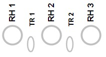
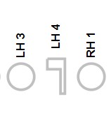

One of my goals for building an instrument fingering chart site is to make it easier to look up a note and see a really clear illustration of what keys should be pressed. While there have been fingering chart sites since the dawn of the internet (I used a few in undergrad and grad school!), they suffered from the limitations of images on the web - small, fuzzy, non-dynamic.

I had the opportunity to poke a little bit at SVGs for a work project and I decided this would be a good opportunity to try to work on some basics. The advantages I expected were better scalability for different devices and removing the need to store a lot of images. Let's be honest - my eyes are getting bad and I wanted something that was easier to see for me!

Flutes are really accomodating for this kind of project - six of the pressable keys are circles! I looked up the W3 Schools tutorial on [creating an SVG circle](https://www.w3schools.com/graphics/svg_circle.asp) and made some circles that I could tailor. One of these sample circles was included in my [currying events blog](https://kristenkinnearohlmann.dev/static/cdd1622f6231a833480521f1a959b93d/c80d3/app-click.jpg).


Once I got the circles working and clickable in the manner I desired, I decided to tackle more keys. The next most obvious choice were the trill keys for the right hand, since they are often depicted as ovals. I used the [W3 Schools ellipse tutorial](https://www.w3schools.com/graphics/svg_ellipse.asp) as my starting point. W3 Schools has a _Try It_ editor where I could carefully edit and see the shape until it became a shape I felt was representative enough. I added some top margin to push the trill keys into better position in the diagram.



I had now completed all the keys with defined geometric shapes; all that remained were the specially shaped keys. I decided to start with the left hand 4 key (aka the G sharp or A flat key). Using my best skills gathered from [Ed Emberley](https://en.wikipedia.org/wiki/Ed_Emberley) books, I determined the key was a full, horizontal rectangle connected to a thin, vertical rectangle.

I recalled from my work project that SVG shapes can be drawn as paths. I read through Paul Ryan's Medium blog on [SVG Path Basics](https://developer.mozilla.org/en-US/docs/Web/SVG/Tutorial/Paths) that very helpful explained how a very simple path worked; it reminded me of learning how to read a map by being in my imaginary car driving on the map! I also reviewed the information on the [Mozilla SVG Paths tutorial](https://developer.mozilla.org/en-US/docs/Web/SVG/Tutorial/Paths) to understand how to structure a more complicated path once I had an understanding of the basics. Finally, I tracked down the [SVG Path Editor](https://yqnn.github.io/svg-path-editor/) I found for the work project I contributed to.

After making a guess on width and height and drawing my expected shape, I added the code to my development site. It was so small! Through some trial and error, I found I was able to adjust my SVG path object to basically sit where I want it to and be large enough to correlate to the other keys.

```JavaScript
        <div id="key-lh-4" class="key-item">
            <p class="key-name">LH 4</p>
            <svg height="60" width="40">
            <path d="M 10 10 h 20 v 40 h -5 v -28 h -15 v -12" stroke="silver" stroke-width="3" fill="none" />
            Sorry, your browser does not support inline SVG.
            </svg>
        </div>
```

In the code above, the start of the path is `M` with coordinates to state where the "pen" will be dropped. The subsequent `h` and `v` markers tell the path which direction to draw in and the numerical value is the amount of pixels. Negative pixels go back toward the origin; positive pixels move away from the origin. I styled the stroke, width and fill the same as the other keys at rest. The SVH height and width ensured the basic block of the SVG was similar in size to my other keys. I now have a left hand 4 key!



In the short term, this key works well as an analog to the physical key on the flute. Future enhancements include adjusting the position so the key aligns a little better to the other keys as well a working on making some of the edges more curved to better represent the physical key.

I'm glad to have some basic use cases to learn how to create SVGs. Other developers and designers have done amazing work with this kind of code, creating complex logos and images that can scale well and are not dependent on an image editing application. Finding some great explanatory blogs and articles as well as a handy editor assisted me in quickly developing the first of several keys that are more specialized and I believe I can get the remaining keys completed with this new knowledge.