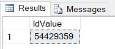
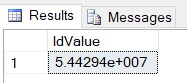
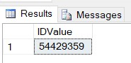

I ran into an interesting problem this week creating backfill data for an analytics process that involved a non-GUID ID value. The data is processed and stored in Microsoft SQL Server databases. These ID values are 8 numeric characters that ultimately are used as data type `nvarchar` in ETL processing.

My source data was an Excel spreadsheet I imported using the **Import** item from the standard **Tasks** option in SQL Server Management Studio. When I examined the data after import, the values appeared as I expected.  


I completed development on the needed transformations for the data. Since I planned to export the final table to each server where it was needed, I added an `INTO <schema.table>` statement to the final temp table to create the permanent table for the data. When I returned to QA the data, I noticed my ID values were now in scientific notation.  


Ultimately, these values are aggregated in a visualization tool for trends and predictions; these values would not accurately match those already in the table. When I checked the table that was created from my `INTO` statement, I found the ID column was translated as a float. I changed the data type to `nvarchar` and added a simple conversion to the `INSERT` statement to resolve.

```sql
SELECT CONVERT(nvarchar,@IDValue) As IdValue
```

This still resulted in a value that was in scientific notation!

By keying into the fact that SQL Server was identifying the ID value as a `float`, I located a solution for T-SQL that ensured the conversion of the value to `nvarchar` was complete and accurate.

```sql
SELECT CONVERT(nvarchar,CONVERT(bigint,@IDValue)) As IDValue
```



By first converting the `float` value to `bigint`, the actual value is preserved. Further converting the resulting `bigint` value to `nvarchar` ensures a smooth insert into the table via an explicit data type. With this revised conversion, I was able to finish building the needed backfill table to complete my work.
